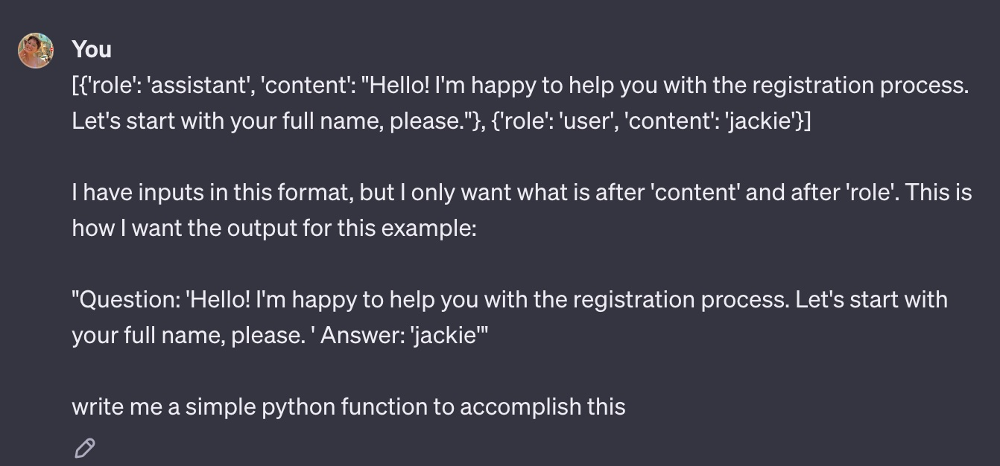

# GenAI Summer Camp Chatbot Project 🌐
## Paradox Home Assignment 👾

### Developer: Maya Halevy

## Overview
This project consists of a Python-based chatbot designed for the GenAI Summer Camp. The chatbot, named Jennifer, assists in handling inquiries about the camp and managing the registration process for campers parents. 

## Program Logic

User input flows first through a router model. This model acts as a binary classifier that determines if the user is looking for camp information or is ready to register. If the user is looking for camp information, the input is passed into the inquiry chatbot which is ready to answer any question about the camp's details. At any time during this conversation the user can decide that they are ready to register, and the router chatbot will direct the input to the registration chatbot. The registration chatbot is the only model that retains conversation history in order to avoid asking the same questions twice. The registration model is shadowed by a parser model that behaves as an information extractor. It distills the necessary information from the registration process allowing the program to exit gracefully once all necessary information has been collected. 

## Instructions to Run the Project for MacOS/Linux
- Clone the repo and activate a virtual enviornment inside it 
- Install the dependancies using `pip install -r requirements.txt`
- Set your API key as an environment variable `export OPENAI_API_KEY=your_api_key_here`
- Execute the program from the command line `python3 chatbot.py`

## Generation of GenAI Summer Camp 🌞🤖🌟
Get ready for an extraordinary adventure at the GenAI Summer Camp! Held at the Tel Aviv University from August 18 to 29, 2024, this camp is perfect for children aged 7-14 who are eager to dive into the world of technology and machine learning. At GenAI, we blend traditional outdoor activities like swimming and games with engaging workshops on tech topics, all in a supportive and fun environment. We have access to top-notch facilities, including a university swimming pool and a cafeteria! Join us for a summer to remember. 

## Open Questions

### How would you optimize the process if you had more time?

I have been able to reduce the token usage of the prompts, but with more time I would be able to refine it futher. 

### How would you test the prompts' performance?

I have tested the prompts performance over several possible conversations. The general inquiry chatbot was originally consistently telling parents that the camp provided transportation services, despite the training samples indicating otherwise. The most likely reason for this is that gpt-3.5 training data contains far more situations of camps providing transportation than not. I stuck with the policy of not providing transportation as it  helps demonstrate that the chatbot is effectively trained with few shot learning. 

As for the router model, I tested it on many wordy examples, to make sure it out-performed a hard-coded program that simply searches for 'enroll' or 'register' keywords. This model is now able to understand nuance, and only deploys the registration form when the user is ready to fill it. 

**Prompt Performance:**
---

---

This conversation (user in green) shows the router model initially triggering the inquiry model, despite the user mentioning wanting to register. Once the user displays a clear intent to sign-up the router triggers the registration model. We can also see the the parser model in action as it identifies and stores the parent name in a dictionary.

### What edge cases do you think are not handled currently that you would add?

It would be useful to add user input validation, handling of irrelevant inputs, and adding other languages.

## Use of ChatGPT

Chatgpt helped me quicky clean the output from the regristration model before sending it as input to the parser model. 

  ג
