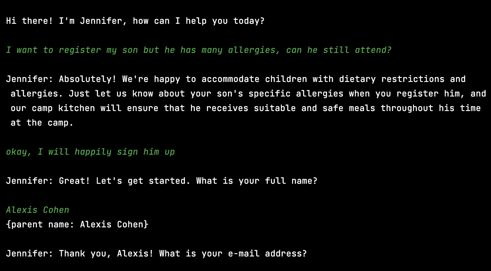

# GenAI Summer Camp Chatbot Project 🌐
## Paradox Home Assignment 👾

### Developer: Maya Halevy

## Overview
This project consists of a Python-based chatbot designed for the GenAI Summer Camp. The chatbot, named Jennifer, assists in handling inquiries about the camp and managing the registration process for campers parents. The project is structured into two main files: chatbot.py, which contains the main logic, and constants.py, which houses the necessary constants for initializing the chatbots.

## Instructions to Run the Project for MacOS/Linux
- Clone the repo and activate a virtual enviornment inside it 
- Install the dependancies using `pip install -r requirements.txt`
- Set your API key as an environment variable using `export OPENAI_API_KEY=your_api_key_here`
- Execute the program from the command line using `python3 chatbot.py`

## Generation of GenAI Summer Camp 🌞🤖🌟
Get ready for an extraordinary adventure at the GenAI Summer Camp! Held at the Tel Aviv University from August 18 to 29, 2024, this camp is perfect for youngsters aged 7-14 who are eager to dive into the world of technology and machine learning. At GenAI, we blend traditional outdoor activities like swimming and games with engaging workshops on tech topics, all in a supportive and fun environment. Enjoy top-notch facilities, including a university swimming pool and a cafeteria! Join us for a summer to remember. 

## Open Questions

### How would you optimize the process if you had more time?

Currently, both models are spending around 500 tokens (approximated using tiktoken) for establishing their persona and training. With more time I would be able to reduce the number of tokens by only including a few key training examples, maximizing cost effectiveness. 

Additionally, I would incorporate another chatbot to discuss registration details with the parent, and then send that conversation to a model in order to parse the registration info from the conversation.

### How would you test the prompts' performance?

I have tested the prompts performance over several possible conversations. The general inquiry chatbot was originally consistently telling parents that the camp provided transportation services, despite the training samples indicating otherwise. After discussing this with ChatGPT I found that the most likely reason for this is that gpt-3.5 training data contains far more situations of camps providing transportation than not. I wanted to stick with the policy of the camp not providing transportation as it would help demonstrate that the chatbot is able to be effectively trained with few shot learning. 

As for the router model I tested it on many wordy examples, to make sure it out-performed a hard-coded program that simply searches for 'enroll' or 'register' keywords. This model is now able to understand nuance, and only deploys the registration form when the user is ready to fill it. 

**Prompt Performance:**
---

---
Note: User input in green

### What edge cases do you think are not handled currently that you would add?

It would be useful to add user input validation, handling of irrelevant inputs, better exit strategy, and adding other languages.

  ג
